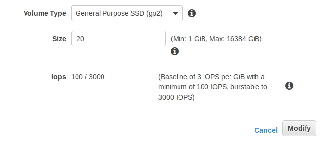

## Extend AWS EBS Volumes with No Downtime
> In order to extend the volume size, follow these simple steps:
1. Login to  **AWS console**

2. Choose **EC2** from the services list.

3. Click on **Volumes** under **ELASTIC BLOCK STORE** menu 

4. Choose the volume that you want to resize, *right click* on **Modify Volume**

5. You’ll see an option window like this one:


6. Set the new size for your EBS volume 
> Let take example to increase it from 8GB volume to 20GB

7. Click on **modify**.

## Now, we need to extend the partition itself.

- SSH to the EC2 instance where the EBS we’ve just extended is attached to.

- Type the following command to list our block devices:
```[ec2-user ~]$ lsblk```

- You should be able to see a similar output:
```NAME    MAJ:MIN RM SIZE RO TYPE MOUNTPOINT
   xvda    202:0    0  20G  0 disk 
 └─xvda1   202:1    0  8G   0 part   /
 ```

- As you can see size of the root volume reflects the new size, 20GB, the size of the partition reflects the original size, 8 GB, and must be extended before you can extend the file system.
```To do so, type the following command:
[ec2-user ~]$ sudo growpart /dev/xvda 0
```
> Be careful, there is a space between device name and partition number!

- Now we can check that the partition reflects the increased volume size (we can check it with the lsblk command we already used):
``` NAME    MAJ:MIN RM SIZE RO TYPE MOUNTPOINT
   xvda    202:0    0  20G  0 disk 
 └─xvda1   202:1    0  20G  0 part   / 
 ```
 
 - Last but not least, we need to extend the filesystem itself. If your filesystem is an ext2, ext3, or ext4, type:
 `[ec2-user ~]$ sudo resize2fs /dev/xvda1`
 
 - If your filesystem is an XFS, then type:
 `[ec2-user ~]$ sudo xfs_growfs /dev/xvda1`
 
 - Finally we can check our extended filesystem by typing:
 `[ec2-user ~]$ df -h`
 
 - If everything went right, we should be able to see our effective filesystem extended size:
 ```Filesystem      Size  Used Avail Use% Mounted on
devtmpfs        980M     0  980M   0% /dev
tmpfs           997M     0  997M   0% /dev/shm
tmpfs           997M  440K  997M   1% /run
tmpfs           997M     0  997M   0% /sys/fs/cgroup
/dev/xvda1      20G   1,4G   19G   7% /
```
**You have just extended your EBS volume size with 0 downtime**
 
